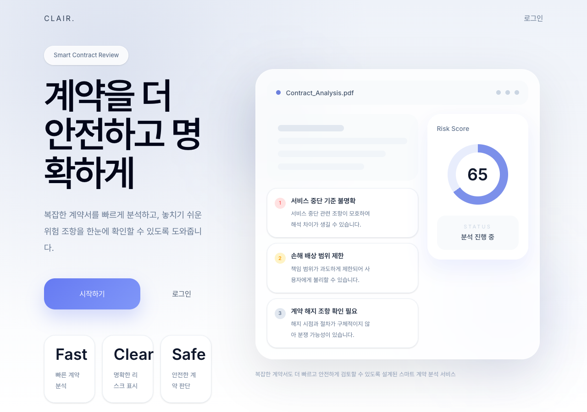
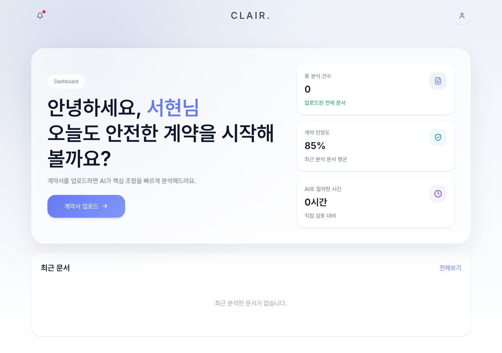
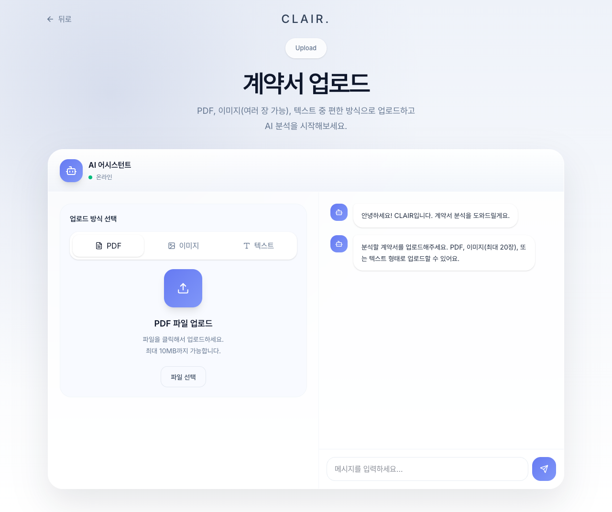
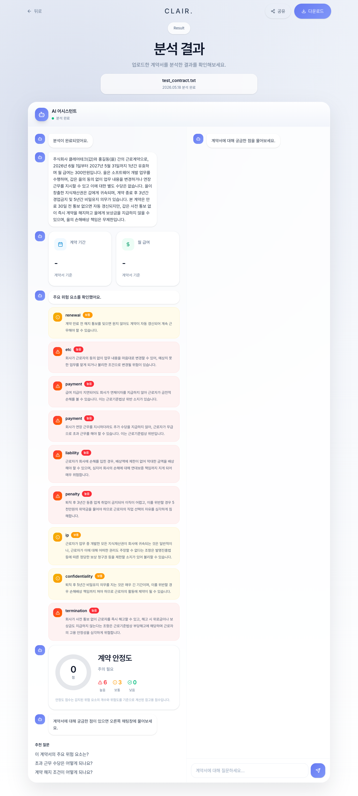
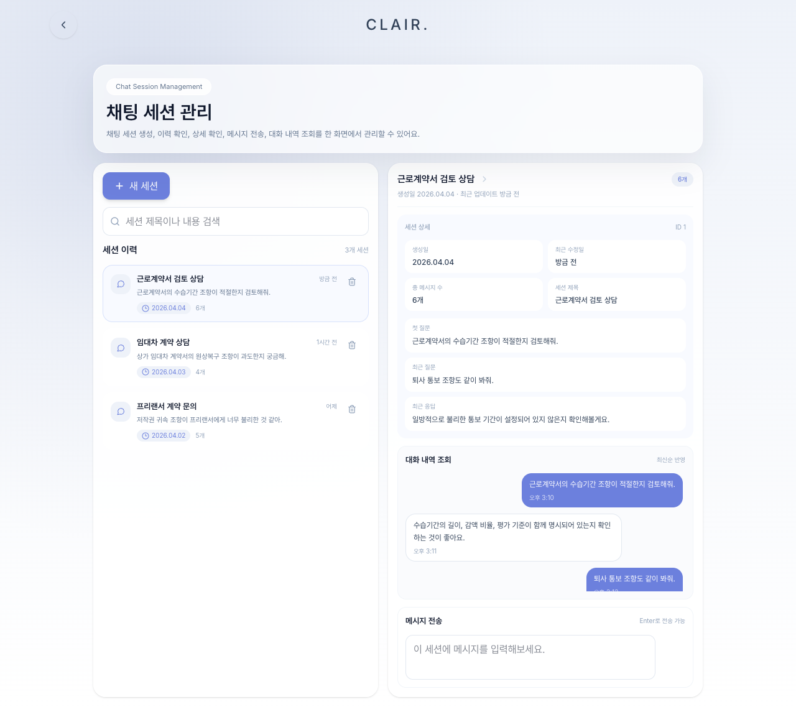
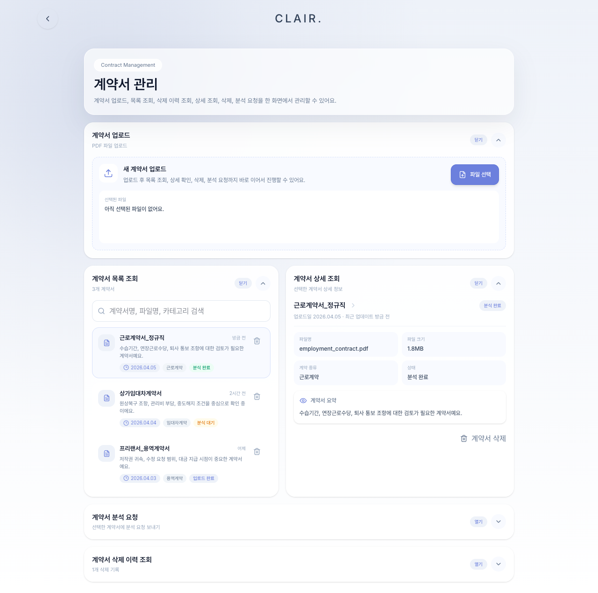

# clair-frontend

CLAIR의 React + TypeScript PWA (port 5173). 계약서 업로드, 분석 결과 확인, Q&A 채팅을 제공한다.

## 화면 미리보기

| 랜딩 | 홈 |
|------|-----|
|  |  |

| 업로드 | 분석 결과 |
|--------|----------|
|  |  |

| Q&A 채팅 | 계약서 관리 |
|----------|-----------|
|  |  |

## 실행

```bash
npm install
npm run dev     # Vite dev server @ http://localhost:5173
npm run build   # tsc + vite build
```

## 환경 변수 (`.env`)

```
VITE_API_URL=http://127.0.0.1:8000
```

## 라우트

| 경로 | 화면 |
|------|------|
| `/` | 스플래시 |
| `/onboarding` | 온보딩 |
| `/login` | 로그인 |
| `/signup` | 회원가입 |
| `/home` | 홈 (계약서 목록) |
| `/upload` | 계약서 업로드 |
| `/loading/:contractId` | 분석 진행 중 (폴링) |
| `/result/:contractId` | 분석 결과 대시보드 |
| `/chat-session` | Q&A 채팅 |
| `/contracts/manage` | 계약서 관리 |
| `/notifications` | 알림 |
| `/profile` | 프로필 |
| `/settings` | 설정 |
| `/share/:token` | 공유 링크 결과 |
| `/password-reset` | 비밀번호 재설정 |

## 주요 구조

- **API 클라이언트** (`src/api/client.ts`) — `VITE_API_URL` 기반, JWT 자동 주입, 401 시 로그인 리다이렉트
- **분석 폴링** — `/loading/:contractId`에서 `GET /api/v1/contracts/{id}`를 3초마다 폴링, `status === 'analyzed'` 확인 후 결과 페이지 이동
- **안전점수** — 백엔드 `analysis.safety_score` 우선 사용
- 전역 상태 라이브러리 없음 (React hooks / context만 사용)
- Tailwind CSS 4 + Radix UI
