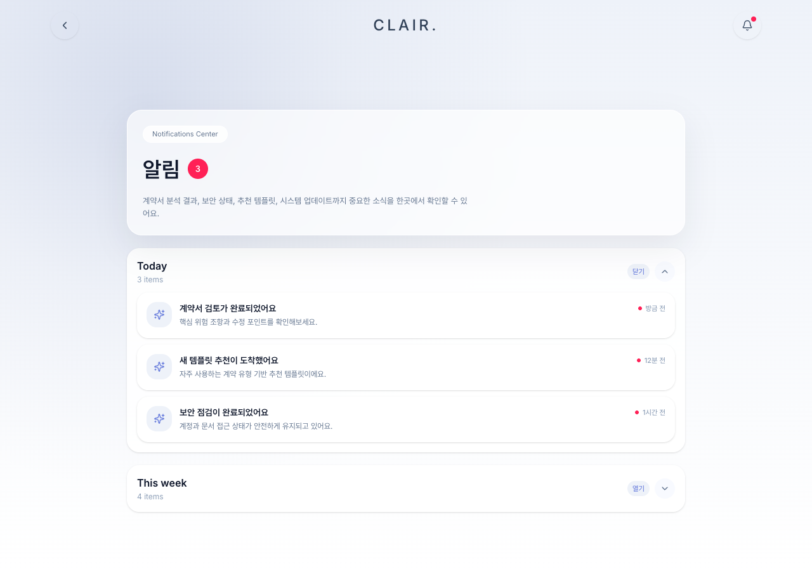
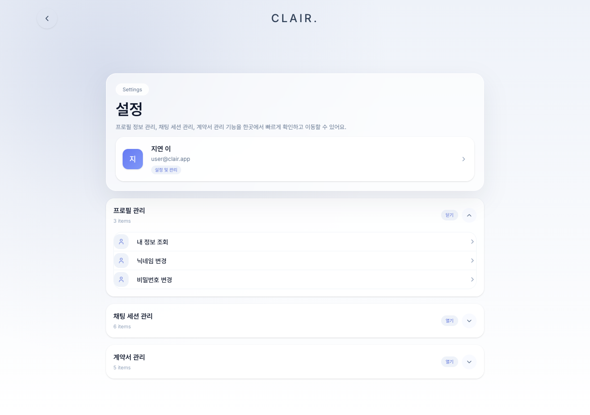

# CLAIR Frontend

CLAIR 프론트엔드는 계약서 업로드, AI 분석 결과 확인, 공유 링크, 알림, 프로필/설정, 계약서 기반 Q&A 채팅을 제공하는 React 애플리케이션입니다.

## Tech Stack

- React 18 + TypeScript
- Vite
- React Router 7
- Tailwind CSS v4
- MUI, Radix UI 기반 shadcn-style primitives
- Axios
- lucide-react

## Preview

| 랜딩 | 홈 |
| --- | --- |
|  |  |

| 업로드 | 분석 결과 |
| --- | --- |
|  |  |

| Q&A 채팅 | 계약서 관리 |
| --- | --- |
|  |  |

| 알림 | 설정 |
| --- | --- |
|  |  |

## Getting Started

```bash
npm install
npm run dev
```

Vite 개발 서버는 기본적으로 `http://localhost:5173`에서 실행됩니다.

## Build

```bash
npm run build
```

현재 별도의 test/lint 스크립트는 구성되어 있지 않습니다.

## Environment Variables

`.env` 파일에 아래 값을 설정합니다.

```env
VITE_API_URL=http://127.0.0.1:8000
VITE_API_BASE_URL=http://127.0.0.1:8000
VITE_FRONT_URL=http://localhost:5173
```

| 변수 | 설명 |
| --- | --- |
| `VITE_API_URL` | Axios API 클라이언트의 base URL |
| `VITE_API_BASE_URL` | 레거시/호환용 API base URL |
| `VITE_FRONT_URL` | 공유 링크 생성 시 사용할 프론트엔드 URL |

## Routes

| 경로 | 화면 |
| --- | --- |
| `/` | 시작 화면 |
| `/onboarding` | 온보딩 |
| `/login` | 로그인 |
| `/signup` | 회원가입 |
| `/password-reset` | 비밀번호 재설정 |
| `/social-callback` | 소셜 로그인 콜백 |
| `/home` | 홈 대시보드 |
| `/upload` | 계약서 업로드 및 분석 요청 |
| `/loading/:contractId` | 분석 진행 상태 |
| `/result/:contractId` | 분석 결과 대시보드 |
| `/share/:token` | 공유 링크 결과 |
| `/chat-session` | 계약서 Q&A 채팅 |
| `/contracts/manage` | 계약서 관리 |
| `/notifications` | 알림 |
| `/profile` | 프로필 |
| `/settings` | 설정 |

## Main Features

- 계약서 PDF, 이미지, 텍스트 업로드
- 계약서 분석 요청 및 분석 진행 상태 표시
- 분석 결과 대시보드, 리스크 조항, 법령 준수 정보, 급여 산출 내역 표시
- 계약서 공유 링크 생성 및 공유 페이지 제공
- 홈 대시보드에서 최근 문서, 분석 통계, 안전점수 기반 지표 표시
- 알림 목록 조회, 페이지네이션, 읽음/전체 읽음 처리
- 소셜 로그인, 프로필 조회/수정, 프로필 이미지 저장
- 설정 화면 및 회원 탈퇴
- 계약서 삭제 이력 관리
- 계약서 기반 Q&A 채팅 세션 관리

## API Layer

모든 주요 HTTP 요청은 `src/api/client.ts`의 Axios 인스턴스를 사용합니다.

- `VITE_API_URL`을 base URL로 사용합니다.
- `localStorage.getItem('accessToken')` 값을 Bearer token으로 자동 주입합니다.
- `401` 응답 시 기본적으로 토큰을 제거하고 `/login`으로 이동합니다.
- 계약서 폴링 요청과 공유 페이지 요청은 화면별 예외 처리를 위해 401 자동 리다이렉트에서 제외합니다.

레거시 파일인 `src/api/axiosInstance.js`가 남아 있지만, 신규 코드는 `src/api/client.ts` 사용을 우선합니다.

## Project Structure

```text
src/
  api/
    client.ts              # Axios client
    socialAuth.ts          # Social auth helpers
  app/
    routes.tsx             # React Router route definitions
    screens/               # Route-level page components
    components/ui/         # Radix/shadcn-style UI primitives
  styles/
    index.css              # Global styles
    theme.css              # Theme variables
    tailwind.css           # Tailwind entry
```

## Development Notes

- 화면 단위 컴포넌트는 `src/app/screens/`에 위치합니다.
- 라우트는 `src/app/routes.tsx`에서 관리합니다.
- 전역 상태 관리 라이브러리는 사용하지 않고, 화면별 `useState`/`useEffect` 중심으로 상태를 관리합니다.
- 경로 별칭 `@`는 `src/`를 가리킵니다.
- 조건부 class 병합에는 `clsx`와 `tailwind-merge` 기반 유틸을 사용합니다.
